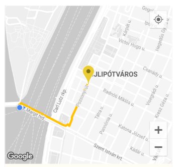

# open_route_service

An encapsulation made around [OpenRouteService API](https://openrouteservice.org) for Dart and Flutter projects. Made for easy generation of Routes and Directions on Maps, Isochrones, Time-Distance Matrix, Pelias Geocoding, POIs, Elevation and routing Optimizations using their amazing API.

## Features

The goal is to develop an all-encompassing package that can encapsulate everything OpenRouteService API offers.

With all of their internal Optimizations, this includes:

1. **Directions:**
   Route Generation between any two or more coordinates for any mode of transportation. For example, from a starting point to a destination on `'foot-walking'`.

   This gives a `List` of `Coordinates` which can then be easily used to draw a Polyline route on a map in a Flutter Application or anything else you can think of.

    | Route Drawn on Map using Coordinates |
    | ------------------------------------ |
    |  |

2. **Isochrones:**

3. **Time-Distance Matrix:**

4. **Pelias Geocoding:**

5. **POIs:**

## Getting started

Run `dart pub add open_route_service` or `flutter pub add open_route_service` to install the package.

## Usage

1. Import the package: `import 'package:open_route_service/open_route_service.dart';` where needed.
2. Create a new instance of the class with your [OpenRouteService API Key](https://openrouteservice.org/dev/#/signup): `OpenRouteService openRouteService = OpenRouteService(apiKey: 'YOUR-API-KEY');`
3. Use the handy class methods to easily generate Directions, Isochrones, Time-Distance Matrix, Pelias Geocoding, POIs, Elevation and routing Optimizations etc, letting the package handle all the complex HTTP requests in the background for you.

Example of how to use the package to use [OpenRoute Service's Directions API](https://openrouteservice.org/dev/#/api-docs/v2/directions):

```dart
import 'package:open_route_service/open_route_service.dart';

Future<void> main() async {
  // Initialize the OpenRouteService with your API key.
  final OpenRouteService client = OpenRouteService(apiKey: 'YOUR-API-KEY');

  // Example coordinates to test between
  const double startLat = 37.4220698;
  const double startLng = -122.0862784;
  const double endLat = 37.4111466;
  const double endLng = -122.0792365;

  // Form Route between coordinates
  final List<Coordinate> routeCoordinates = await client.getRouteCoordinates(
    startCoordinate: Coordinate(startLat, startLng),
    endCoordinate: Coordinate(endLat, endLng),
  );

  // Print the route coordinates
  routeCoordinates.forEach(print);

  // Map route coordinates to a list of LatLng
  // to be used in Polyline
  final List<LatLng> routePoints = routeCoordinates
      .map((coordinate) => LatLng(coordinate.latitude, coordinate.longitude))
      .toList();

  // Create Polyline
  final Polyline routePolyline = Polyline(
    polylineId: PolylineId('route'),
    visible: true,
    points: routePoints,
    color: Colors.red,
    width: 4,
  );

  // Use Polyline to draw route on map or do anything else with the data :)
}

```

## Dependencies

- [Dart](https://www.dartlang.org/), for the Dart SDK which this obviously runs on.
- [http](https://pub.dev/packages/http), for making HTTP requests to the API endpoints.

## Additional information

- Contributions are welcome on [GitHub](https://www.github.com/dhi13man/open_route_service). File any issues or feature requests there or help me resolve existing ones. :)

- Please [contribute to OpenRouteService API by donating](https://openrouteservice.org/donations/) to help keep the service free and accessible to everyone.

- Go through the documentation here: [OpenRouteService API Documentation](https://openrouteservice.org/dev/#/api-docs/v2/directions)
